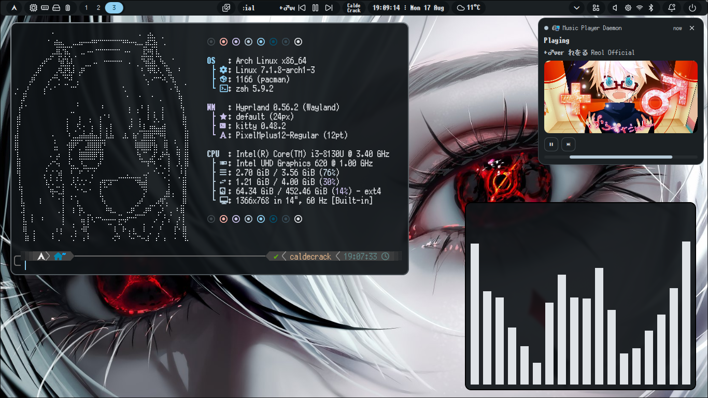
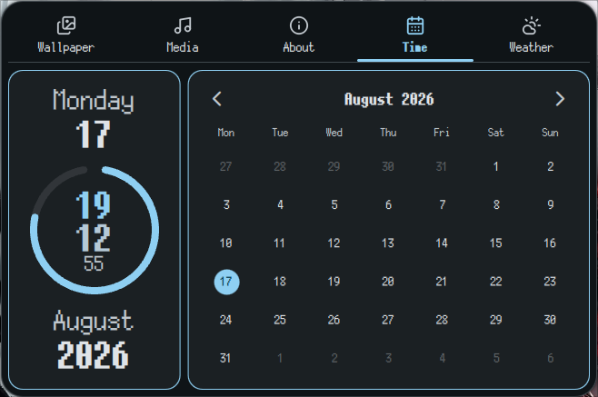
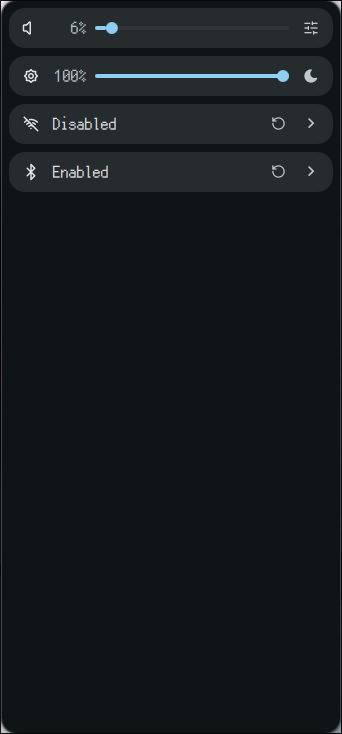
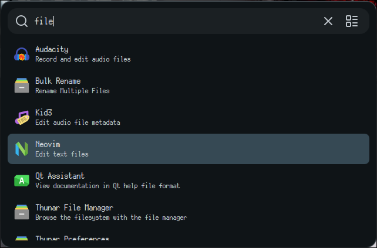

<div align="center">

<!-- assets/logo.svg -->


# CrackShell

A fast, modular desktop shell built on [Quickshell](https://quickshell.org), with dynamic Material You theming via `matugen` and pixel art focused style.

<!-- assets/banner.png -->


</div>

---

## Overview

This is a custom desktop shell: bar, panels, launcher, notifications, control center, and more written in QML on top of Quickshell.

Colors come from [matugen](https://github.com/InioX/matugen), generating a full Material You palette (plus a base16 fallback) from your wallpaper, so the whole shell re-themes itself automatically when your wallpaper changes.

## Features

- 🎨 **Dynamic theming** — Material You colors generated from your wallpaper via matugen, live-reloaded.
- 📊 **Top bar** — workspaces, tray, system stats (CPU/GPU/RAM), media controls, clock, notifications, and more.
- 🗂️ **Info panel** — a tabbed panel (time, weather, media, wallpaper picker, about) opened from bar buttons.
- 🎛️ **Control panel** — sidebar with brightness, volume, Wi-Fi, and Bluetooth controls.
- 🔔 **Notifications** — toasts + a persistent notifications center.
- 🚀 **Launcher** — app launcher.
- ⚡ **Power menu** — shutdown/reboot/suspend/lock overlay.
- ⚙️ **Live config** — JSON-based settings, watched and hot-reloaded.

### Info Panel
<!-- assets/infopanel.png -->


### Control Panel
<!-- assets/controlpanel.png -->


### App Launcher
<!-- assets/launcher.png -->


## Requirements

- [Hyprland](https://hyprland.org) the shell relies on Hyprland-specific bindings, so other compositors aren't currently supported
- [Quickshell](https://quickshell.org)
- [matugen](https://github.com/InioX/matugen) for wallpaper-based color generation
- A [Nerd Font](https://www.nerdfonts.com/) for icon glyphs used in keybind displays

### Optional dependencies

A few services shell out to external tools instead of reimplementing their functionality. These are only needed if you use the corresponding feature:

| Tool | Used for |
| --- | --- |
| [`cava`](https://github.com/karlstav/cava) | Audio visualizer |
| `wl-clipboard` / [`cliphist`](https://github.com/sentriz/cliphist) | Clipboard history |
| [`qalc`](https://qalculate.github.io/) | Calculator |
| `mpd` / `mpc` / [`mpdris2-rs`](https://github.com/eonpatapon/mpDris2) | Music playback (MPD) |
| `systemd` (`systemctl`, `loginctl`) | Power actions (shutdown/reboot/suspend/lock) |
| `ffmpeg` / `wf-recorder` / `slurp` / `grim` / [`hyprshot`](https://github.com/Gustash/hyprshot) | Screen recording & screenshots |
| `nvidia-smi` / `intel_gpu_top` | GPU stats |
| [`jq`](https://jqlang.org/) | JSON parsing in helper scripts |
| [`hyprsunset`](https://github.com/hyprwm/hyprsunset) / [`hyprpicker`](https://github.com/hyprwm/hyprpicker) | Night light & color picker |
| [`hyprsunset`](https://github.com/hyprwm/hyprsunset) | Night light |
| [`hyprpicker`](https://github.com/hyprwm/hyprpicker) | Color picker |
| [`tesseract`](https://github.com/tesseract-ocr/tesseract) / `tesseract-data-eng` (or another language) | OCR |
| `qrencode` / `zbar` | QR encoding and decoding |
| `xdg-tools` | Open files |

## Installation

This repo is managed with [GNU Stow](https://www.gnu.org/software/stow/) and contains config files for several tools beyond the shell itself (including Hyprland).

```bash
mkdir ~/dotfiles
git clone https://github.com/CaldeCrack/CrackShell.git ~/dotfiles
cd ~/dotfiles
stow --adopt .
```

> A more guided installer (dependency checks, matugen setup, etc.) is planned, see [Roadmap](#roadmap).

## Configuration

All user-facing settings live in `config/config.json` and are exposed through the `Settings` singleton:

```json
{
    "bar": {
        "height": 30,
        "margin": 6
    },
    "general": {
        "wallpaperDir": "~/Pictures/Wallpapers"
    },
    "weather": {
        "location": "Santiago",
        "units": "metric"
    }
}
```

Edit the file directly and the shell picks up changes live, no reload required. Keybinds live in a separate `keybinds.json`, watched the same way.

Colors are generated separately by matugen into `~/.local/state/quickshell/generated/colors.json` and consumed by the `Colors` singleton (Material You tokens, a raw palette, and a base16 fallback).

## Project structure

```
quickshell/
├── shell.qml                # entry point: instantiates Bar, Launcher, overlays
├── config/                  # Settings, ConfigLoader, Colors, config.json, keybinds.json
├── services/                # headless singletons: audio, battery, network, media, weather, etc.
├── modules/
│   ├── bar/                 # top bar + its buttons
│   ├── infoPanel/           # tabbed panel (time, media, wallpaper, about)
│   ├── controlPanel/        # sidebar: brightness/bluetooth/wifi/volume
│   ├── notifications/       # toasts + sidebar
│   ├── launcher/            # app launcher
│   ├── powerMenu/           # power overlay
│   ├── osd/                 # on-screen display
│   ├── shortcutsWindow/     # keybind cheat-sheet
│   └── miscApps/            # clipboard, emoji picker, screenshot, etc.
├── widgets/                 # shared building blocks (PanelBase, BarButtonBase, SidebarBase, Tooltip, ...)
├── assets/                  # icons + bundled data (emoji, nerd font glyphs)
└── configApp/               # standalone settings GUI [pending]
```

## Roadmap

- [ ] **MPD library control** — browse/search your library, create and manage playlists, favorite songs, and view the current playlist from the media tab
- [ ] **Configuration app** — a standalone GUI (`configApp/`) for editing settings instead of hand-editing JSON
- [ ] **Dock** — an optional app dock module
- [ ] **Workspace previews** — live thumbnails on hover/switch instead of plain indicators
- [ ] **iCalendar support** — integration with current calendar component
- [ ] **Installer script** — one-command setup (dependency checks, config bootstrap, matugen setup)
- [ ] **Project website** — a GitHub Pages site with docs, screenshots, and a config gallery

Have an idea, feature request or some problem? Open an issue. Feedback is welcome.

## Acknowledgements

This project's visual language and several UX ideas were inspired by other shells in the Quickshell/Hyprland ecosystem, including:

- [Noctalia](https://github.com/noctalia-dev/noctalia-shell)
- [DankMaterialShell](https://github.com/AvengeMedia/DankMaterialShell)
- [Caelestia](https://github.com/caelestia-dots/shell)
- [end-4's dots-hyprland](https://github.com/end-4/dots-hyprland)
- [Marble Shell](https://github.com/vladimir-kraus/marble-shell)
- Various other shells/dotfiles I'd seen from time to time in [unixporn](https://www.reddit.com/r/unixporn/)

Huge thanks to their authors and communities, this shell wouldn't look or work the way it does without studying their approaches first.

Also the SVGs were created using as a base icons from the following projects:

- [Lucide](https://lucide.dev/icons/)
- [Tabler](https://tabler.io/icons)

Thanks to them creating the pixel art SVGs was a much smoother process than it would've been otherwise.

## License

Licensed under [CC BY-NC-SA 4.0](https://creativecommons.org/licenses/by-nc-sa/4.0/) you're free to use, copy, modify, and redistribute this configuration, including for other projects, as long as you give credit, share adaptations under the same license, and don't use it commercially.
